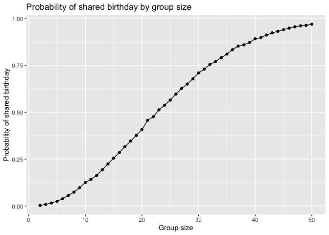
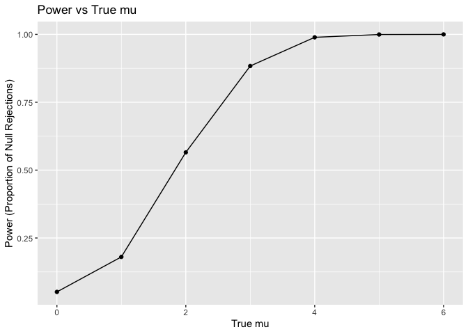
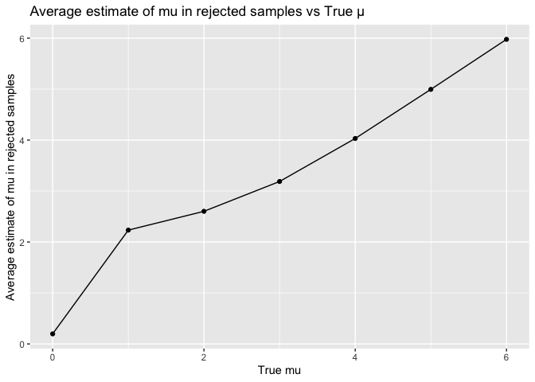
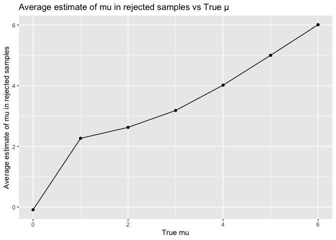
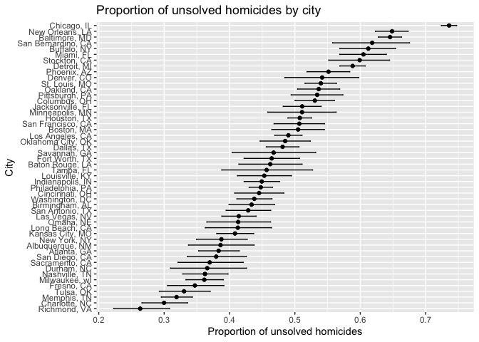

p8105_hw5_zc2822
================
Zhengyong Chen

## Problem 1

``` r
simulate_birthdays = function(n) {
  birthdays = sample(1:365, n, replace = TRUE) 
  any(duplicated(birthdays)) 
}

group_sizes = 2:50
num = 10000

results = data.frame(
  group_size = group_sizes,
  probability = sapply(group_sizes, function(n) {
    mean(replicate(num, simulate_birthdays(n)))
  })
)

results |> 
  ggplot(aes(x = group_size, y = probability)) +
  geom_line() +
  geom_point() +
  labs(
    title = "Probability of shared birthday by group size",
    x = "Group size",
    y = "Probability of shared birthday"
  )
```

<!-- -->

As the group size grows, the probability of at least two people sharing
a birthday increases rapidly. When group sizes approach 50, the
probability tends to be more certain.

## Problem 2

``` r
n = 30
sigma = 5
alpha = 0.05
mu = 0:6
num = 5000

run_sim = function(mu) {
  results = data.frame(estimate = numeric(num), p_value = numeric(num), mu = numeric(num))
  
  for (i in 1:num) {
    data = rnorm(n, mean = mu, sd = sigma)
    test_result = t.test(data, mu = 0) 
    tidy_result = broom::tidy(test_result)
    results$estimate[i] = tidy_result$estimate
    results$p_value[i] = tidy_result$p.value
    results$mu[i] = mu
  }
  
  return(results)
}

sim_results = mu |> 
  map(run_sim) |> 
  bind_rows()
```

Make a plot showing the proportion of times the null was rejected (the
power of the test) on the y axis and the true value of 𝜇on the x axis.
Describe the association between effect size and power.

``` r
sim_results |> 
  group_by(mu) |> 
  summarize(power = mean(p_value < alpha)) |> 
  ggplot(aes(x = mu, y = power)) +
  geom_line() +
  geom_point() +
  labs(title = "Power vs True mu",
       x = "True mu",
       y = "Power (Proportion of Null Rejections)")
```

<!-- -->

Make a plot showing the average estimate of 𝜇̂ on the y axis and the true
value of 𝜇 on the x axis.

``` r
sim_results |> 
  group_by(mu) |> 
  summarize(avg_estimate = mean(estimate)) |> 
  ggplot(aes(x = mu, y = avg_estimate)) +
  geom_line() +
  geom_point() +
  labs(title = "Average Estimate of mu vs True mu",
       x = "True mu",
       y = "Average Estimate of mu")
```

<!-- -->

Make a second plot (or overlay on the first) the average estimate of 𝜇̂
only in samples for which the null was rejected on the y axis and the
true value of 𝜇 on the x axis. Is the sample average of 𝜇̂ across tests
for which the null is rejected approximately equal to the true value of
𝜇 ? Why or why not?

``` r
sim_results |> 
  filter(p_value < alpha) |> 
  group_by(mu) |> 
  summarize(avg_rejected_estimate = mean(estimate)) |> 
  ggplot(aes(x = mu, y = avg_rejected_estimate)) +
  geom_line() +
  geom_point() +
  labs(title = "Average estimate of mu in rejected samples vs True μ",
       x = "True mu",
       y = "Average estimate of mu in rejected samples")
```

<!-- -->

## Problem 3

``` r
homicide = read.csv("data/homicide-data.csv")
```

The homicide data has 52179 rows and 12 columns. The variables are: uid,
reported_date, victim_last, victim_first, victim_race, victim_age,
victim_sex, city, state, lat, lon, disposition.

Create a city_state variable (e.g. “Baltimore, MD”) and then summarize
within cities to obtain the total number of homicides and the number of
unsolved homicides (those for which the disposition is “Closed without
arrest” or “Open/No arrest”).

``` r
homicide_summary = homicide |>
  mutate(state = if_else(city == "Tulsa" & state == "AL", "OK", state)) |> 
  mutate(city_state = paste(city, state, sep = ", ")) |>  
  group_by(city_state) |> 
  summarize(
    total_homicides = n(), 
    unsolved_homicides = sum(disposition %in% c("Closed without arrest", "Open/No arrest"))
  )
```

For the city of Baltimore, MD, use the prop.test function to estimate
the proportion of homicides that are unsolved; save the output of
prop.test as an R object, apply the broom::tidy to this object and pull
the estimated proportion and confidence intervals from the resulting
tidy dataframe.

``` r
baltimore_data = homicide_summary |> 
  filter(city_state == "Baltimore, MD")

prop_test_result = prop.test(baltimore_data$unsolved_homicides, baltimore_data$total_homicides)
tidy_result = broom::tidy(prop_test_result)

est_prop = tidy_result$estimate
ci_low = tidy_result$conf.low
ci_high = tidy_result$conf.high

cat("estimated proportion:", est_prop)
```

    ## estimated proportion: 0.6455607

``` r
cat("confidence interval:", "[", ci_low, ci_high, "]", sep = "")
```

    ## confidence interval:[0.62756250.6631599]

Now run prop.test for each of the cities in your dataset, and extract
both the proportion of unsolved homicides and the confidence interval
for each. Do this within a “tidy” pipeline, making use of purrr::map,
purrr::map2, list columns and unnest as necessary to create a tidy
dataframe with estimated proportions and CIs for each city.

``` r
eachcity_prop = homicide_summary |> 
  mutate(
    prop_test = map2(unsolved_homicides, total_homicides, ~ tidy(prop.test(.x, .y))),
    estimate = map(prop_test, ~.x$estimate),
    conf.low = map(prop_test, ~.x$conf.low),
    conf.high = map(prop_test, ~.x$conf.high)
  ) |>
  unnest(c(estimate, conf.low, conf.high)) |>
  select(city_state, estimate, conf.low, conf.high)

eachcity_prop
```

    ## # A tibble: 50 × 4
    ##    city_state      estimate conf.low conf.high
    ##    <chr>              <dbl>    <dbl>     <dbl>
    ##  1 Albuquerque, NM    0.386    0.337     0.438
    ##  2 Atlanta, GA        0.383    0.353     0.415
    ##  3 Baltimore, MD      0.646    0.628     0.663
    ##  4 Baton Rouge, LA    0.462    0.414     0.511
    ##  5 Birmingham, AL     0.434    0.399     0.469
    ##  6 Boston, MA         0.505    0.465     0.545
    ##  7 Buffalo, NY        0.612    0.569     0.654
    ##  8 Charlotte, NC      0.300    0.266     0.336
    ##  9 Chicago, IL        0.736    0.724     0.747
    ## 10 Cincinnati, OH     0.445    0.408     0.483
    ## # ℹ 40 more rows

``` r
eachcity_prop |> 
  arrange(estimate) |> 
  ggplot(aes(x = reorder(city_state, estimate), y = estimate)) +
  geom_point() +  
  geom_errorbar(aes(ymin = conf.low, ymax = conf.high), width = 0.2) + 
  coord_flip() +  
  labs(
    title = "Proportion of unsolved homicides by city",
    x = "City",
    y = "Proportion of unsolved homicides"
  )
```

<!-- -->
