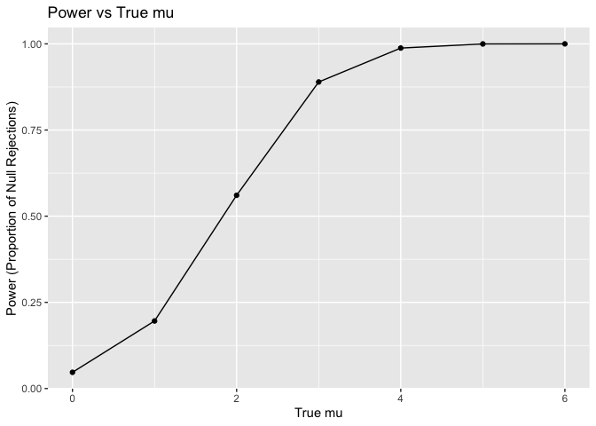
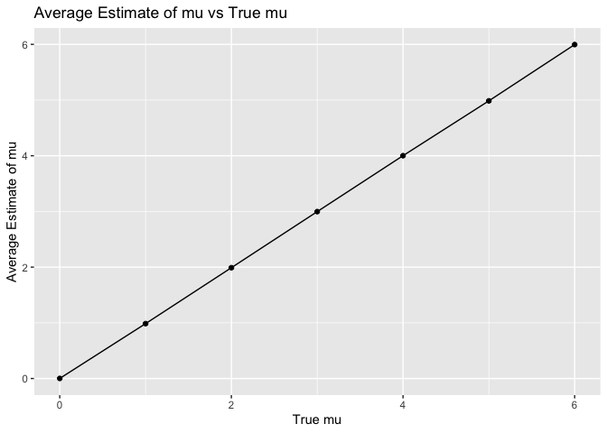

p8105_hw5_zc2822
================
Zhengyong Chen

## Problem 2

``` r
n = 30
sigma = 5
alpha = 0.05
mu = 0:6
num = 5000

run_sim = function(mu) {
  results = data.frame(estimate = numeric(num), p_value = numeric(num), mu = numeric(num))
  
  for (i in 1:num) {
    data = rnorm(n, mean = mu, sd = sigma)
    test_result = t.test(data, mu = 0) 
    tidy_result = broom::tidy(test_result)
    results$estimate[i] = tidy_result$estimate
    results$p_value[i] = tidy_result$p.value
    results$mu[i] = mu
  }
  
  return(results)
}

sim_results = mu |> 
  map(run_sim) |> 
  bind_rows()
```

Make a plot showing the proportion of times the null was rejected (the
power of the test) on the y axis and the true value of 𝜇on the x axis.
Describe the association between effect size and power.

``` r
sim_results |> 
  group_by(mu) |> 
  summarize(power = mean(p_value < alpha)) |> 
  ggplot(aes(x = mu, y = power)) +
  geom_line() +
  geom_point() +
  labs(title = "Power vs True mu",
       x = "True mu",
       y = "Power (Proportion of Null Rejections)")
```

<!-- -->

Make a plot showing the average estimate of 𝜇̂ on the y axis and the true
value of 𝜇 on the x axis.

``` r
sim_results |> 
  group_by(mu) |> 
  summarize(avg_estimate = mean(estimate)) |> 
  ggplot(aes(x = mu, y = avg_estimate)) +
  geom_line() +
  geom_point() +
  labs(title = "Average Estimate of mu vs True mu",
       x = "True mu",
       y = "Average Estimate of mu")
```

<!-- -->

Make a second plot (or overlay on the first) the average estimate of 𝜇̂
only in samples for which the null was rejected on the y axis and the
true value of 𝜇 on the x axis. Is the sample average of 𝜇̂ across tests
for which the null is rejected approximately equal to the true value of
𝜇 ? Why or why not?

``` r
sim_results |> 
  filter(p_value < alpha) |> 
  group_by(mu) |> 
  summarize(avg_rejected_estimate = mean(estimate)) |> 
  ggplot(aes(x = mu, y = avg_rejected_estimate)) +
  geom_line() +
  geom_point() +
  labs(title = "Average estimate of mu in rejected samples vs True μ",
       x = "True mu",
       y = "Average estimate of mu in rejected samples")
```

<!-- -->
